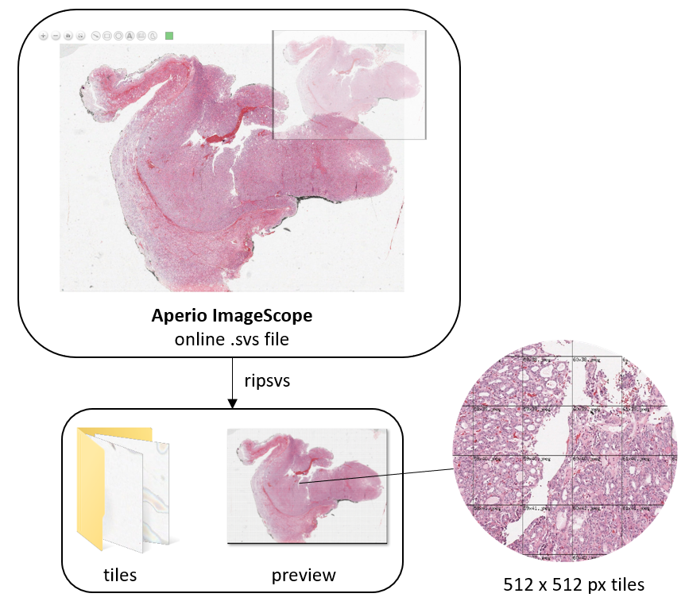

# ripsvs
An .svs extraction tool for whole slide images.



## Limited Initial Deployment
Currently designed to extract 512 x 512 pixel tiles from online .svs files hosted by Aperio ImageScope. 

Initially tested for the .svs files in the [Nikiforov BoxA samples](http://image.upmc.edu:8080/NikiForov%20EFV%20Study/BoxA/view.apml?listview=1).

Further work may extend to additional image hosting domains.

## Getting Started

```bash
# Download and build the extraction tool:
git clone https://github.com/jholdstock/ripsvs
cd ripsvs
go build .

# Extract tiles from space-separated .svs file names:
./ripsvs A001 A002  # Linux
or
ripsvs.exe A001 A002  # Windows
```

An "output" folder will be created with separate folders for each .svs file processed. Within those folders will be the 512 x 512 px tiles as well as a preview image of the whole slide image.
